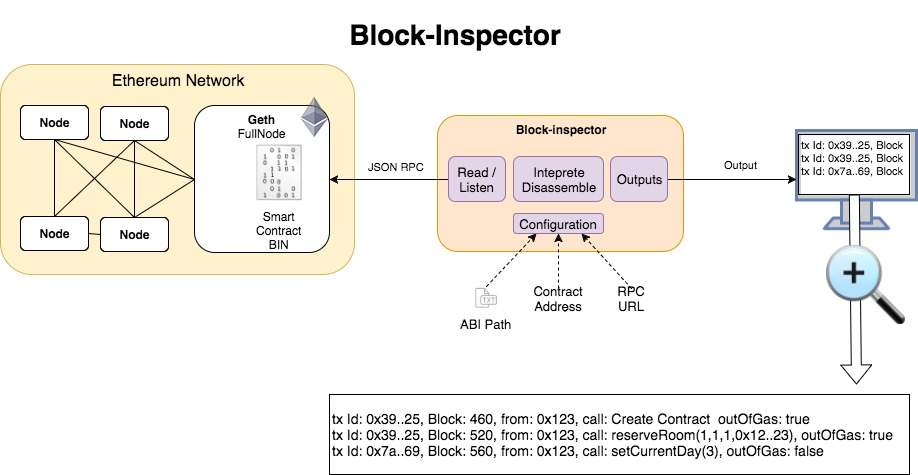

# Block inspector 

**Work in progress**

A command line tool for:
* Inspecting all transactions to your Ethereum smart contract
* Disassembling the method names and parameters
In real time.. 




## Installation
- NodeJS > v6.10

```bash

# At the first time
npm install

npm run test
npm run start

# Debugging with Visual Studio Code: Press F5. 
```

## Notes
- [Ethereum records](./docs/records.md)